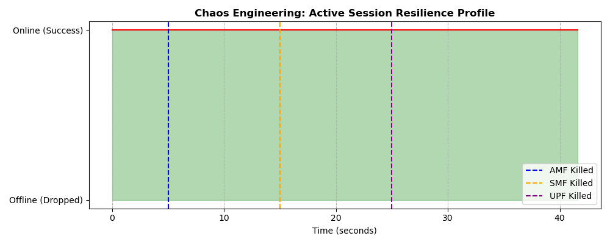

# 5G Core Resilience & CUPS Validation via Chaos Engineering

A site reliability engineering (SRE) and telecommunications project designed to test the fault tolerance and architectural resilience of a Cloud-Native 5G Standalone (SA) core network. Utilizing Dockerized Open5GS, UERANSIM, and targeted Chaos Engineering fault injection, this project empirically validates the 3GPP Control and User Plane Separation (CUPS) architecture and container self-healing capabilities.

---

## Theoretical Concept: CUPS and Cloud-Native Resilience

Modern 5G Cores operate as decoupled microservices managed by container orchestrators. This architecture provides two distinct layers of resilience:
1. **Control and User Plane Separation (CUPS):** 5G separates signaling (AMF, SMF) from actual data forwarding (UPF). If a mobile device has an active data session, a catastrophic failure of the Control Plane should not interrupt the User Plane traffic.
2. **Auto-Recovery:** Orchestrators detect container crashes and enforce auto-restart policies to spin up fresh clones of the failed service instantaneously.

---

## Project Structure

```
open5gs-chaos-engineering-resilience/
├── data/
│   └── ping_trace.txt
├── docs/
|   ├── chaos-engineering-resilience-report.pdf
│   └── Resilience_Scorecoard.png
├── src/
│   ├── analyze_resilience.py
|   └── chaos_test.sh
├── .gitignore
├── LICENSE
└── README.md
```
---

## Prerequisites & Initial Setup

This simulation operates on Ubuntu 22.04 LTS utilizing Docker, Open5GS, and UERANSIM.

### 1. Install Dependencies
Ensure Docker Compose and analytical Python libraries are installed.
```bash
sudo apt install python3-pandas python3-matplotlib iputils-ping
docker compose version
```
### 2. Initialize the User Plane Interface
Create a virtual routing interface to allow the Dockerized UPF to route data to the external network.

```bash
sudo ip tuntap add name ogstun mode tun
sudo ip addr add 10.45.0.1/16 dev ogstun
sudo ip link set ogstun up
```

---

## Execution Procedure

### 1. Generate Cloud-Native Blueprints
Navigate to the root of this repository. Generate the `Dockerfile` and `docker-compose.yml` directly in the workspace using the following terminal commands:

**Generate Dockerfile**:
```bash
cat << 'EOF' > Dockerfile
FROM ubuntu:22.04
ENV DEBIAN_FRONTEND=noninteractive
RUN apt-get update && apt-get install -y software-properties-common curl gnupg && \
    add-apt-repository -y ppa:open5gs/latest && \
    apt-get update && apt-get install -y open5gs
EOF
```
**Generate Docker Compose Blueprint:**
```bash
cat << 'EOF' > docker-compose.yml
version: '3.8'

x-open5gs: &open5gs-base
  build: .
  network_mode: "host"
  restart: always

services:
  mongo:
    image: mongo:7.0
    network_mode: "host"
    restart: always
  nrf:
    <<: *open5gs-base
    command: open5gs-nrfd
  udr:
    <<: *open5gs-base
    command: open5gs-udrd
  udm:
    <<: *open5gs-base
    command: open5gs-udmd
  ausf:
    <<: *open5gs-base
    command: open5gs-ausfd
  pcf:
    <<: *open5gs-base
    command: open5gs-pcfd
  amf:
    <<: *open5gs-base
    container_name: amf
    command: open5gs-amfd
  smf:
    <<: *open5gs-base
    container_name: smf
    command: open5gs-smfd
  upf:
    <<: *open5gs-base
    container_name: upf
    command: open5gs-upfd
    privileged: true
EOF
```

### 2. Deploy the Core & Provision Subscriber
Launch the container fleet in detached mode. Wait approximately 2 minutes for the initial build to complete.
```bash
docker compose up --build -d
```
Inject the subscriber credentials (IMSI `999700000000001`) directly into the isolated MongoDB container utilizing the `open5gs-dbctl` utility.
```bash
curl -sSL [https://raw.githubusercontent.com/open5gs/open5gs/main/misc/db/open5gs-dbctl](https://raw.githubusercontent.com/open5gs/open5gs/main/misc/db/open5gs-dbctl) -o open5gs-dbctl
chmod +x open5gs-dbctl
docker cp open5gs-dbctl chaos_engineering-mongo-1:/tmp/
docker exec -it chaos_engineering-mongo-1 /tmp/open5gs-dbctl add 999700000000001 465B5CE8B199B49FAA5F0A2EE238A6BC E8ED289DEBA952E4283B54E88E6183CA
```

### 3. Boot RAN and Establish Active Session
Start the gNodeB and the UE to trigger registration and establish a PDU session.
```bash
./nr-gnb -c ../config/open5gs-gnb.yaml &
sleep 3
sudo ./nr-ue -c ../config/open5gs-ue.yaml
```

### 4. Execute Chaos Fault Injection (`chaos_test.sh`)
Execute the chaos script located in `src/`. This script initiates a high-speed ICMP ping trace (5 requests per second) to log packet delivery and timestamps. Systematically, the script forcefully terminates the AMF (5s), SMF (15s), and UPF (25s) containers to observe the network's reaction.
```bash
bash src/chaos_test.sh
```

### 5. Run Python Resilience Analysis
Run the analytical pipeline to parse the ICMP sequence numbers, detect packet drops, and plot the recovery scorecard against the fault injection timestamps.
```bash
python3 src/generate_scorecard.py
```
---

## Results & Artifacts
The execution of the chaos test empirically proves the CUPS architecture and container self-healing policies.



* AMF Failure (Blue Line): When the Access and Mobility Management Function is terminated, active ICMP traffic remains at 100% success, proving active sessions survive control-node failures.

* SMF Failure (Orange Line): When the Session Management Function is terminated, the active routing rules in the UPF remain untouched, resulting in zero packet loss.

* UPF Failure (Purple Line): Because the UPF is the physical router for the user plane, its termination drops the active traffic temporarily. However, the immediate recovery of the success line demonstrates Docker's automated self-healing policy spinning up a new UPF instance to restore service.

---

### References

* 3GPP TS 23.501: System Architecture for the 5G System; Stage 2 (Release 17).
* 3GPP TS 23.527: Restoration Procedures for 5G System; Stage 2 (Network Function resilience and state synchronization).
* Rosenthal, C., & Jones, L. (2020). Chaos Engineering: System Resiliency in Practice. O'Reilly Media.
* Open5GS Official Documentation (2024). Kubernetes Helm Chart Deployment and NF Configuration.
* Kubernetes Official Documentation: Pod Lifecycle, Liveness/Readiness Probes, and ReplicaSets.
---
